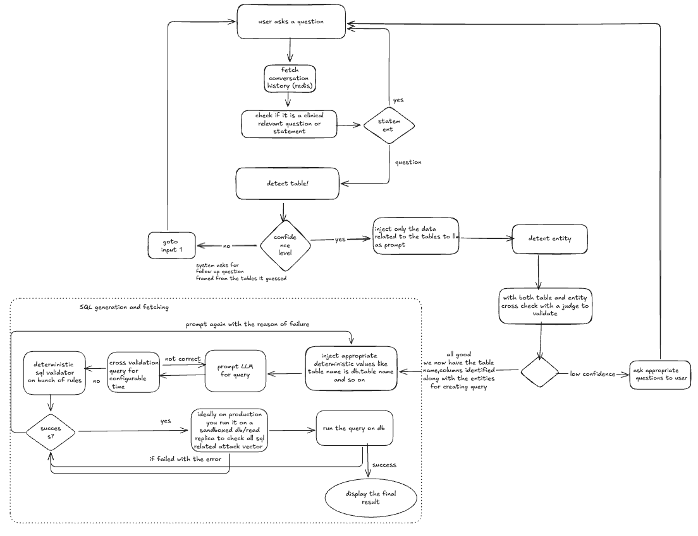

# NL2SQL

Clinical trial data query system using natural language to SQL conversion with LLM-powered validation.

## design 

## Prerequisites

- Python 3.13+
- uv package manager
- Podman or Docker
- Azure OpenAI API access

## Setup

### 1. Install Dependencies

```bash
make install
```

### 2. Configure Environment

Copy the example environment file and update with your credentials:

```bash
cp .env.example .env
```

Edit .env with your Azure OpenAI credentials:

```
OPENAI_API_TYPE=azure
OPENAI_API_KEY=your_api_key_here
OPENAI_API_BASE=https://your-endpoint.openai.azure.com/
OPENAI_API_VERSION=2025-03-01-preview
MODEL=gpt-5.2

REDIS_HOST=localhost
REDIS_PORT=6379
REDIS_DB=0

CUSTOMER_ID=cust_01
SESSION_ID=550e8400-e29b-41d4-a716-446655440000
```

### 3. Start Redis

Build and start the Redis container:

```bash
make redis-build
make redis-start
```

Check Redis logs if needed:

```bash
make redis-logs
```

## Running the Application

### Standard Run

```bash
make run
```

### Clean Run

Clear Redis session data and start fresh:

```bash
make run_clean
```

The application will be available at http://localhost:8501

## Testing

Run all tests:

```bash
uv run pytest tests/ -v
```

Run specific test files:

```bash
make test-redis
uv run pytest tests/test_sql_validator.py -v
```

## Project Structure

- main.py - Streamlit application entry point
- llm.py - LLM interaction functions
- prompt.py - System prompts for LLM
- sql_validator.py - SQL validation and security checks
- session_manager.py - Redis session management
- models.py - Pydantic data models
- data/database_data.py - Clinical trial schema definitions
- tests/ - Test suite

## Stopping Services

Stop Redis:

```bash
make redis-stop
```

Clean up Redis container and image:

```bash
make redis-clean
```

## Features

- Natural language to SQL query conversion
- Multi-table clinical trial data queries
- SQL validation with syntax and security checks
- Automatic query improvement loop
- Conversation history with context awareness
- Follow-up question handling